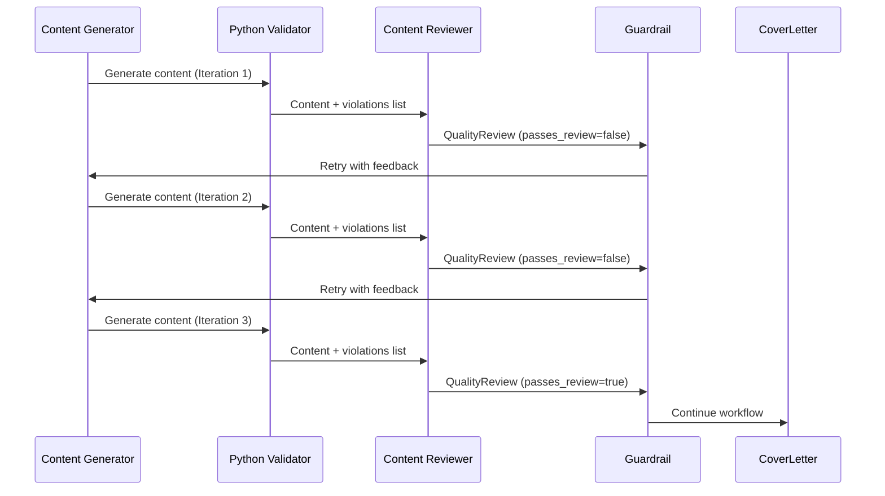

# Agentic Resume Generation Workflow

## Overview

The Resume as Code system uses a multi-agent AI architecture powered by CrewAI to automatically generate tailored resume profiles from job descriptions. This document describes the complete end-to-end workflow.

## Architecture: Hybrid PydanticAI + CrewAI

- **PydanticAI**: Single-agent tasks (job analysis for existing profiles)
- **CrewAI**: Multi-agent workflows (profile generation)
- **Shared**: All agents use the same Pydantic models for type safety

## Complete Workflow Diagram

```mermaid
flowchart TD
    Start([User runs generate-profile]) --> CheckCV{CV file<br/>provided?}

    CheckCV -->|No| LoadDefault[Load default CV<br/>data/common/experience.yml]
    CheckCV -->|Yes - YAML| LoadCustom[Load custom YAML CV]
    CheckCV -->|Yes - PDF| ConvertPDF[convert-cv command<br/>Extract + Parse PDF]

    ConvertPDF --> PDFExtract[pdfplumber extracts text]
    PDFExtract --> PDFParse[GPT-4 parses to YAML]
    PDFParse --> LoadCustom

    LoadDefault --> ReadJob[Read job description]
    LoadCustom --> ReadJob

    ReadJob --> InitAgents[Initialize 4 CrewAI Agents<br/>+ Style Rules]

    InitAgents --> Agent1

    subgraph CrewAI Sequential Workflow
        Agent1[Agent 1: Job Analyzer<br/>Analyzes job description]
        Agent1 --> JobAnalysis[JobAnalysisResult<br/>- Required skills<br/>- Preferred skills<br/>- Role level/type<br/>- Responsibilities]

        JobAnalysis --> Agent2[Agent 2: Content Generator<br/>Reframes experience for job]
        Agent2 --> ResumeContent[ResumeContent<br/>- Header title<br/>- Summary<br/>- Tailored achievements<br/>- Prioritized skills]

        ResumeContent --> PythonValidation[Python Style Validation<br/>Check em dashes, first person,<br/>action verbs, bullet length]

        PythonValidation --> Agent3[Agent 3: Content Reviewer<br/>Quality assurance]
        Agent3 --> QualityReview[QualityReview<br/>- Passes review?<br/>- Alignment score /10<br/>- Style compliance /10<br/>- Issues + suggestions]

        QualityReview --> Guardrail{Guardrail:<br/>Review passed?}

        Guardrail -->|No - Retry| Feedback[Provide feedback to<br/>Content Generator]
        Feedback --> RetryCount{Retry < 3?}
        RetryCount -->|Yes| Agent2
        RetryCount -->|No| ForceContinue[Continue with<br/>best attempt]

        Guardrail -->|Yes| Agent4[Agent 4: Cover Letter Writer<br/>Generates cover letter]
        ForceContinue --> Agent4

        Agent4 --> CoverLetter[CoverLetter<br/>- Opening paragraph<br/>- Body paragraphs<br/>- Closing + CTA]
    end

    CoverLetter --> Display[Display Results<br/>Job analysis summary<br/>Quality scores<br/>Content preview]

    Display --> Confirm{User confirms<br/>write files?}

    Confirm -->|No| Cancel([Cancelled])
    Confirm -->|Yes| WriteFiles[Write 6 Profile Files<br/>header.yml, summary.yml<br/>experience.yml, skills.yml<br/>job.txt, cover_letter.md]

    WriteFiles --> Success([Profile Created!<br/>Ready for build])

    style Agent1 fill:#e3f2fd
    style Agent2 fill:#fff3e0
    style Agent3 fill:#f3e5f5
    style Agent4 fill:#e8f5e9
    style Guardrail fill:#ffebee
    style Success fill:#c8e6c9
```



## Detailed Component Breakdown

### 1. CV Input Options

Users can provide their CV in three ways:

#### Option A: Default CV (No --cv flag)
```bash
uv run resume generate-profile senior-sdet --job job.txt
```
- Loads `data/common/experience.yml`
- Good for: Quick testing, shared team CV

#### Option B: Custom YAML CV
```bash
uv run resume generate-profile senior-sdet --job job.txt --cv ~/my-cv.yml
```
- Loads specified YAML file
- Good for: Personal CVs, different versions

#### Option C: PDF CV (Auto-convert)
```bash
# Step 1: Convert PDF to YAML
uv run resume convert-cv Tom-Drake-CV.pdf

# Step 2: Use converted YAML
uv run resume generate-profile senior-sdet --job job.txt --cv Tom-Drake-CV.yml
```
- Extracts text with `pdfplumber`
- Parses with GPT-4 into structured YAML
- Good for: Existing PDF resumes

### 2. The Four AI Agents

#### Agent 1: Job Analyzer
**Role**: Technical Recruiter and Job Analyst
**Goal**: Extract precise requirements from job descriptions
**Delegation**: Not allowed

**Inputs**:
- Job description text

**Outputs** (JobAnalysisResult):
- `required_skills`: List of must-have skills
- `preferred_skills`: List of nice-to-have skills
- `key_responsibilities`: Top 5-7 duties
- `role_level`: Seniority (Junior, Mid, Senior, Staff, Principal)
- `role_type`: Role category (SDET, SRE, QE Leadership)
- `company_culture_notes`: Cultural indicators

**System Prompt Focus**:
- Extract specific technical skills (e.g., "Kubernetes", not "containers")
- Identify actual tools/technologies mentioned
- Avoid soft skills unless explicitly technical

---

#### Agent 2: Content Generator
**Role**: Resume Content Strategist
**Goal**: Create tailored, ATS-friendly resume content
**Delegation**: Not allowed

**Inputs**:
- Job analysis result (from Agent 1)
- Existing work experience (from CV)
- Style rules configuration

**Outputs** (ResumeContent):
- `header_title`: Professional title matching target role
- `summary`: 3-4 sentence professional summary
- `experiences`: Reframed achievement bullets
- `skills`: Prioritized skills for target job

**System Prompt Focus**:
- Start bullets with strong action verbs (past tense)
- Quantify achievements with metrics (numbers, percentages)
- NO em dashes (—) or en dashes (–)
- NO first-person pronouns (I, my, we, our)
- Keep bullets under 120 characters
- Avoid buzzwords (rockstar, ninja, synergy)

---

#### Agent 3: Content Reviewer
**Role**: Resume Quality Assurance Specialist
**Goal**: Ensure quality standards and style compliance
**Delegation**: **Allowed** (can ask Generator to revise)

**Inputs**:
- Generated resume content (from Agent 2)
- Style rules for validation
- Python validation results

**Outputs** (QualityReview):
- `passes_review`: Boolean (triggers retry if false)
- `alignment_score`: 1-10 (job match quality)
- `style_compliance_score`: 1-10 (style rule adherence)
- `issues_found`: Specific problems with examples
- `suggestions`: Constructive improvements
- `strengths`: What's working well

**System Prompt Focus**:
- Check style violations (em dashes, first person, weak verbs)
- Validate achievement quantification
- Ensure job keyword optimization
- Assess ATS compatibility
- Only pass if alignment ≥ 7 AND style ≥ 8

**Guardrail Function**:
```python
def quality_guardrail(output: TaskOutput) -> tuple[bool, str]:
    quality_review = output.pydantic
    if not quality_review.passes_review:
        return (False, f"Quality review failed: alignment={quality_review.alignment_score}/10")
    return (True, "")
```
- Returns `(False, message)` → CrewAI auto-retries (up to 3x)
- Returns `(True, "")` → Continue to next agent

---

#### Agent 4: Cover Letter Writer
**Role**: Cover Letter Specialist
**Goal**: Write compelling cover letters
**Delegation**: Not allowed

**Inputs**:
- Job analysis result (from Agent 1)
- Resume content (from Agent 2)

**Outputs** (CoverLetter):
- `opening_paragraph`: Hook related to company/role
- `body_paragraphs`: 2-3 paragraphs with achievements
- `closing_paragraph`: Clear call to action

**System Prompt Focus**:
- Professional but conversational tone
- 3-4 paragraphs maximum (concise!)
- Highlight 2-3 most relevant achievements
- Show cultural fit with specific examples
- No clichés ("passionate team player", "hit the ground running")
- Demonstrate genuine interest in THIS role at THIS company

### 3. Style Validation (Two-Layer Approach)

#### Layer 1: Python Validation (Fast, Deterministic)
```python
class StyleRules(BaseModel):
    no_em_dashes: bool = True
    no_first_person: bool = True
    action_verb_start: bool = True
    max_bullet_length: int = 120
    quantify_achievements: bool = True
    no_buzzwords: list[str] = ["synergy", "rockstar", "ninja"]
```

**Checks**:
- Em dash detection: `"—" in bullet`
- First person: Regex for `\bI\b`, `\bmy\b`, `\bwe\b`, `\bour\b`
- Action verbs: Check for weak starts ("Responsible for", "Worked on")
- Bullet length: `len(bullet) > max_bullet_length`
- Buzzwords: Case-insensitive match against list

**Violations returned to Agent 3** for inclusion in review.

#### Layer 2: AI Review (Nuanced, Context-Aware)
Agent 3 evaluates:
- Job alignment quality (does experience match?)
- Achievement impact (are metrics meaningful?)
- ATS optimization (are keywords naturally integrated?)
- Overall professionalism

### 4. Iterative Review Loop



**Maximum Iterations**: 3
**Success Criteria**: `passes_review == true` OR max iterations reached
**Feedback Loop**: Guardrail provides specific scores and issues to Generator

### 5. Output Files

The system writes 6 files to `data/profiles/{profile_name}/`:

#### 1. `header.yml`
```yaml
title: "Senior SDET | Quality Engineering Leader"
```

#### 2. `summary.yml`
```yaml
content: "Accomplished SDET with 10+ years experience..."
```

#### 3. `experience.yml`
```yaml
experiences:
  - company: "Salesforce"
    title: "Lead SDET"
    start_date: "2022-01-01"
    current: true
    achievements:
      - "Architected end-to-end test automation reducing release time by 60%"
      - "Led team of 8 SDETs across web, mobile, and API testing"
    technologies:
      - "Selenium"
      - "Python"
      - "Jenkins"
```

#### 4. `skills.yml`
```yaml
skills:
  - name: "Selenium WebDriver"
    category: "Test Automation"
    proficiency: "Expert"
  - name: "Python"
    category: "Programming"
    proficiency: "Expert"
```

#### 5. `job.txt`
```
[Original job description text for reference]
```

#### 6. `cover_letter.md`
```markdown
I am writing to express my strong interest in the Senior SDET position at Salesforce...

In my current role as Lead SDET, I architected an end-to-end test automation framework...

I would welcome the opportunity to discuss how my experience aligns with your needs...
```

## CLI Command Reference

### Generate Profile (Main Command)

```bash
# Basic usage with default CV
uv run resume generate-profile senior-sdet --job job.txt

# With custom CV (YAML)
uv run resume generate-profile senior-sdet \
  --job job.txt \
  --cv ~/my-cv.yml

# With custom style rules
uv run resume generate-profile staff-sre \
  --job job.txt \
  --cv ~/my-cv.yml \
  --max-bullet-length 100 \
  --no-em-dashes \
  --auto-build

# Skip confirmation (for CI/CD)
uv run resume generate-profile principal-sdet \
  --job job.txt \
  --cv ~/my-cv.yml \
  --skip-confirmation
```

**Options**:
- `--job, -j`: Path to job description text file (required)
- `--cv, -c`: Path to CV YAML file (optional, defaults to data/common/experience.yml)
- `--no-em-dashes`: Reject em dashes in content (default: true)
- `--no-first-person`: Reject first-person pronouns (default: true)
- `--max-bullet-length`: Maximum bullet character length (default: 120)
- `--auto-build`: Automatically build PDF after generation (default: false)
- `--skip-confirmation`: Skip user confirmation (default: false)
- `--data-dir, -d`: Resume data directory (optional)

### Convert CV (Helper Command)

```bash
# Convert PDF to YAML (creates same-name .yml file)
uv run resume convert-cv Tom-Drake-CV.pdf

# Specify output path
uv run resume convert-cv Tom-Drake-CV.pdf --output my-cv.yml
```

**Process**:
1. Extract text from PDF using `pdfplumber`
2. Parse text with GPT-4 into structured YAML
3. Validate and save YAML file
4. Display preview of extracted data

## Performance Metrics

**Typical Execution Times**:
- PDF Conversion: 10-15 seconds
- Profile Generation: 30-60 seconds
  - Job Analysis: 5-10 seconds
  - Content Generation: 10-20 seconds
  - Content Review: 5-10 seconds
  - Cover Letter: 5-10 seconds

**Quality Metrics**:
- Alignment Score: Target ≥ 7/10
- Style Compliance: Target ≥ 8/10
- Retry Rate: ~20-30% need 2+ iterations
- Success Rate: ~95% pass review within 3 attempts

## Integration with Existing Workflow

```bash
# Complete end-to-end workflow
# 1. Convert CV (one-time)
uv run resume convert-cv Tom-Drake-CV.pdf

# 2. Generate profile
uv run resume generate-profile senior-sdet \
  --job salesforce-sdet-job.txt \
  --cv Tom-Drake-CV.yml

# 3. Analyze quality (optional)
uv run resume analyze senior-sdet

# 4. Build resume
uv run resume build senior-sdet --format pdf

# 5. View all profiles
uv run resume list-profiles
```

## Troubleshooting

### Common Issues

**Issue**: "CV file not found"
```bash
# Solution: Use absolute path or check current directory
uv run resume generate-profile senior-sdet \
  --job job.txt \
  --cv ~/Documents/my-cv.yml
```

**Issue**: "Job description file is empty"
```bash
# Solution: Ensure job.txt has content
cat job.txt  # Verify content exists
```

**Issue**: Quality review fails after 3 attempts
```bash
# Solution: Review generated content and retry with adjusted style rules
uv run resume generate-profile senior-sdet \
  --job job.txt \
  --max-bullet-length 150  # Allow longer bullets
```

**Issue**: PDF extraction fails
```bash
# Solution: Ensure PDF is text-based, not scanned image
# Try: pdftotext Tom-Drake-CV.pdf test.txt
# If that fails, PDF may need OCR
```

## Advanced Usage

### Custom Style Rules
```bash
# Strict style enforcement
uv run resume generate-profile senior-sdet \
  --job job.txt \
  --max-bullet-length 100 \
  --no-em-dashes \
  --no-first-person

# Relaxed style (allow longer bullets)
uv run resume generate-profile senior-sdet \
  --job job.txt \
  --max-bullet-length 150
```

### External Data Directory
```bash
# Use private data directory (e.g., iCloud)
export RESUME_DATA_DIR=~/iCloud/resume-data

uv run resume generate-profile senior-sdet \
  --job ~/Downloads/job.txt \
  --cv ~/iCloud/resume-data/my-cv.yml
```

### CI/CD Integration
```bash
# Automated generation without prompts
uv run resume generate-profile senior-sdet \
  --job job.txt \
  --cv cv.yml \
  --skip-confirmation \
  --auto-build
```

## Future Enhancements

Planned improvements:
- [ ] LinkedIn summary generator (5th agent)
- [ ] Thank you email generator (6th agent)
- [ ] Multi-provider support (Anthropic Claude, Google Gemini)
- [ ] A/B testing of different prompts
- [ ] Resume scoring and recommendations
- [ ] Batch generation for multiple jobs
- [ ] OCR support for scanned PDFs

## References

- [CrewAI Documentation](https://docs.crewai.com/)
- [PydanticAI Documentation](https://ai.pydantic.dev/)
- [Resume Best Practices](https://www.indeed.com/career-advice/resumes-cover-letters)
- [ATS Optimization Guide](https://www.jobscan.co/blog/ats-resume/)
